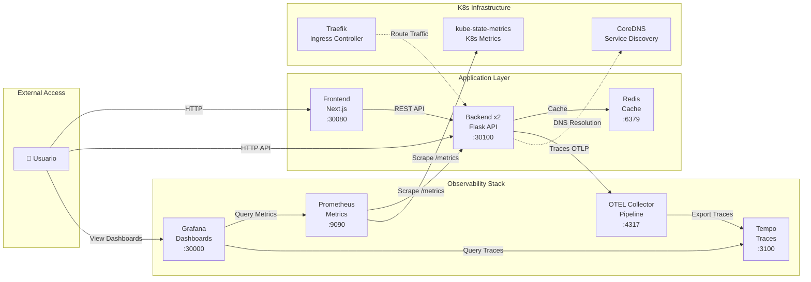
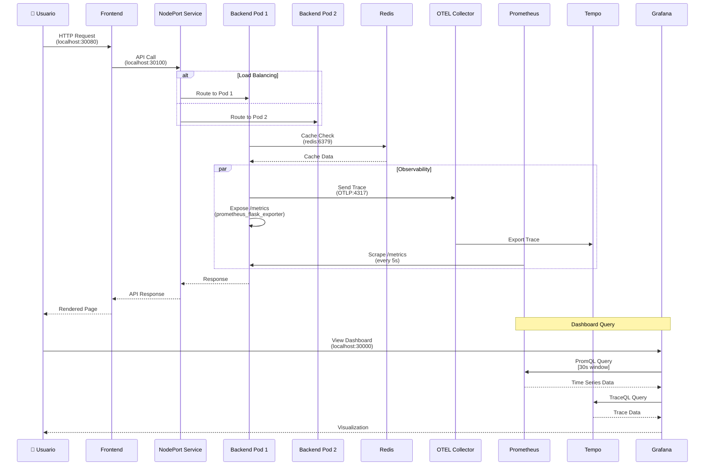
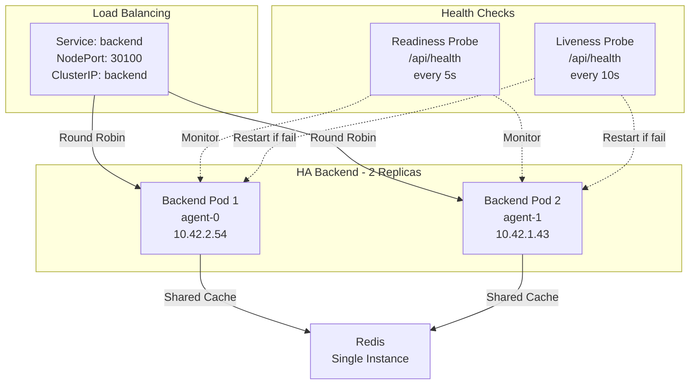
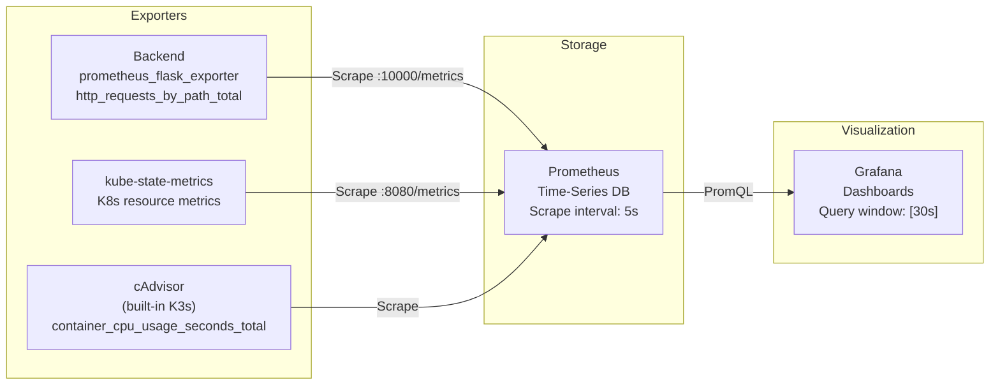
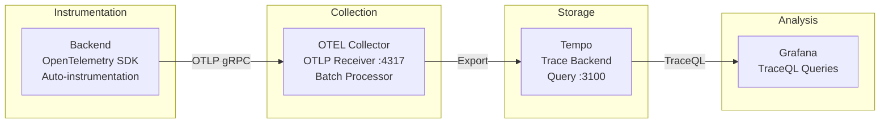

# Arquitectura del Sistema - Description Evaluator

## Cluster Kubernetes con Observabilidad y Alta Disponibilidad

---

## 📊 Visión General del Cluster

```mermaid
graph TB
    subgraph "K3d Cluster - tp2-cluster"
        subgraph "Control Plane Node"
            SERVER["🎯 k3d-tp2-cluster-server-0<br/>ROLE: control-plane, master<br/>IP: 172.18.0.2"]

            subgraph "Pods en Server Node"
                FRONT["frontend-7d8dd94ccf-64k5s<br/>🌐 Next.js UI<br/>IP: 10.42.0.32"]
                GRAF["grafana-68cd4bdbbb-bnv2n<br/>📈 Visualización<br/>IP: 10.42.0.40"]
                SVCLB1["svclb-traefik<br/>⚖️ Load Balancer<br/>IP: 10.42.0.30"]
            end
        end

        subgraph "Worker Node 1"
            AGENT0["🔧 k3d-tp2-cluster-agent-0<br/>ROLE: worker<br/>IP: 172.18.0.5"]

            subgraph "Pods en Agent-0"
                BACK1["backend-7d5675b4f8-rmmpl<br/>📦 Replica 1<br/>IP: 10.42.2.54"]
                OTEL["otel-collector<br/>🔭 Telemetry<br/>IP: 10.42.2.38"]
                REDIS["redis-6fbd565ddb-bgm6l<br/>💾 Cache<br/>IP: 10.42.2.32"]
                TEMPO["tempo-7555f6bd7d-dvc7v<br/>🔍 Traces<br/>IP: 10.42.2.33"]
                SVCLB2["svclb-traefik<br/>⚖️ Load Balancer<br/>IP: 10.42.2.31"]
            end
        end

        subgraph "Worker Node 2"
            AGENT1["🔧 k3d-tp2-cluster-agent-1<br/>ROLE: worker<br/>IP: 172.18.0.3"]

            subgraph "Pods en Agent-1"
                BACK2["backend-7d5675b4f8-79lvx<br/>📦 Replica 2<br/>IP: 10.42.1.43"]
                KSMTX["kube-state-metrics<br/>📊 K8s Metrics<br/>IP: 10.42.1.24"]
                PROM["prometheus-75f754f445-s69xl<br/>📉 Time Series DB<br/>IP: 10.42.1.23"]
                SVCLB3["svclb-traefik<br/>⚖️ Load Balancer<br/>IP: 10.42.1.21"]
            end
        end
    end

    subgraph "Host Machine"
        HOST["🖥️ Windows Host<br/>WSL2 Kernel<br/>Docker Desktop"]
    end

    HOST -.->|Port 30000| GRAF
    HOST -.->|Port 30080| FRONT
    HOST -.->|Port 30100| BACK1
    HOST -.->|Port 30100| BACK2
```



---

## 🏗️ Arquitectura de Comunicación



---

## 🔄 Flujo de Datos Detallado



---

## 📦 Distribución de Pods por Nodo

### **Control Plane Node** (k3d-tp2-cluster-server-0)

| Pod                       | Tipo           | Replicas | Puerto | Propósito                  |
| ------------------------- | -------------- | -------- | ------ | -------------------------- |
| frontend-7d8dd94ccf-64k5s | Application    | 1/1      | 80     | Next.js UI                 |
| grafana-68cd4bdbbb-bnv2n  | Observability  | 1/1      | 3000   | Visualización de métricas  |
| svclb-traefik             | Infrastructure | 2/2      | -      | Load balancer para Traefik |

**Características:**

- ✅ Roles: `control-plane`, `master`
- ✅ Maneja el API Server de Kubernetes
- ✅ **NO aloja backends** (scheduler prefiere workers puros)
- ✅ Frontend y Grafana para acceso rápido
- ✅ Reserva recursos para control plane

---

### **Worker Node 1** (k3d-tp2-cluster-agent-0)

| Pod                             | Tipo           | Replicas | Puerto | Propósito                  |
| ------------------------------- | -------------- | -------- | ------ | -------------------------- |
| backend-7d5675b4f8-rmmpl        | Application    | 1/2      | 10000  | Flask API - Replica 1      |
| otel-collector-5d8f5777cb-sl8mm | Observability  | 1/1      | 4317   | Pipeline de telemetría     |
| redis-6fbd565ddb-bgm6l          | Database       | 1/1      | 6379   | Cache en memoria           |
| tempo-7555f6bd7d-dvc7v          | Observability  | 1/1      | 3100   | Almacenamiento de trazas   |
| svclb-traefik                   | Infrastructure | 2/2      | -      | Load balancer para Traefik |

**Características:**

- ✅ Worker node principal
- ✅ Contiene toda la infraestructura de storage (Redis, Tempo)
- ✅ **Primera réplica del backend** (podAntiAffinity garantiza distribución)

---

### **Worker Node 2** (k3d-tp2-cluster-agent-1)

| Pod                                 | Tipo           | Replicas | Puerto | Propósito                  |
| ----------------------------------- | -------------- | -------- | ------ | -------------------------- |
| backend-7d5675b4f8-79lvx            | Application    | 1/2      | 10000  | Flask API - Replica 2      |
| kube-state-metrics-5fc5c89cdf-mmvvb | Observability  | 1/1      | 8080   | Métricas de estado de K8s  |
| prometheus-75f754f445-s69xl         | Observability  | 1/1      | 9090   | Time-series database       |
| svclb-traefik                       | Infrastructure | 2/2      | -      | Load balancer para Traefik |

**Características:**

- ✅ Worker node secundario
- ✅ **Segunda réplica del backend** (podAntiAffinity garantiza distribución)
- ✅ Dedicado a observabilidad (Prometheus, kube-state-metrics)
- ✅ Stack de métricas concentrado aquí

---

## 🎯 Alta Disponibilidad (HA) - Estrategia



**Garantías de HA:**

1. **2 réplicas del backend** distribuidas en nodos diferentes (agent-0 y agent-1)
2. **podAntiAffinity explícito** - `requiredDuringSchedulingIgnoredDuringExecution` garantiza que nunca haya 2 backends en el mismo nodo
3. **Readiness probes cada 5s** - Tráfico solo a pods sanos
4. **Liveness probes cada 10s** - Auto-restart si falla
5. **NodePort Service** con balanceo round-robin automático
6. **Resiliencia a nivel de nodo** - Si un worker cae, el pod se recrea automáticamente en otro nodo disponible

---

## 📊 Stack de Observabilidad

### Métricas (Prometheus Stack)



**Métricas Clave Monitoreadas:**

- ✅ **CPU Usage**: `rate(container_cpu_usage_seconds_total[30s])`
- ✅ **Memory Usage**: `container_memory_usage_bytes`
- ✅ **RPS (All)**: `rate(http_requests_by_path_total[30s])`
- ✅ **RPS (Business)**: `rate(http_requests_by_path_total{path!~"/api/health|/metrics"}[30s])`
- ✅ **Latency p95/p50**: `histogram_quantile(0.95, rate(flask_http_request_duration_seconds_bucket[30s]))`
- ✅ **Pod Restarts**: `kube_pod_container_status_restarts_total`

---

### Trazas (OpenTelemetry + Tempo)



**Información Capturada:**

- ✅ **Trace ID**: Identificador único de request
- ✅ **Span ID**: Segmentos de operación
- ✅ **Duration**: Tiempo de ejecución
- ✅ **Status**: Success/Error
- ✅ **Attributes**: method, path, status_code

---

## 🌐 Exposición de Servicios

### NodePort Services

| Servicio     | Puerto Interno | NodePort | Propósito  | Acceso                 |
| ------------ | -------------- | -------- | ---------- | ---------------------- |
| **Frontend** | 80             | 30080    | Next.js UI | http://localhost:30080 |
| **Backend**  | 10000          | 30100    | Flask API  | http://localhost:30100 |
| **Grafana**  | 3000           | 30000    | Dashboards | http://localhost:30000 |

### ClusterIP Services (Solo interno)

| Servicio           | Puerto | Tipo      | Consumidores |
| ------------------ | ------ | --------- | ------------ |
| **redis**          | 6379   | ClusterIP | Backend pods |
| **prometheus**     | 9090   | ClusterIP | Grafana      |
| **tempo**          | 3100   | ClusterIP | Grafana      |
| **otel-collector** | 4317   | ClusterIP | Backend pods |

---

## 🔧 Configuración de Recursos

### Backend (Flask API)

```yaml
resources:
  requests:
    memory: "256Mi" # Mínimo garantizado
    cpu: "100m" # 0.1 core
  limits:
    memory: "512Mi" # Límite para testing OOMKilled
    cpu: "500m" # 0.5 core máximo
```

### Frontend (Next.js)

```yaml
resources:
  requests:
    memory: "128Mi"
    cpu: "100m"
  limits:
    memory: "256Mi"
    cpu: "250m"
```

### Redis (Cache)

```yaml
resources:
  requests:
    memory: "128Mi"
    cpu: "100m"
  limits:
    memory: "256Mi"
    cpu: "250m"
```

---

## 🚀 Proceso de Deploy y Restart

### Startup completo

```bash
# 1. Crear cluster k3d
k3d cluster create tp2-cluster \
  --servers 1 \
  --agents 2 \
  --port "30080:30080@server:0" \
  --port "30100:30100@server:0" \
  --port "30000:30000@server:0"

# 2. Importar imágenes
k3d image import devopsregistrytp.azurecr.io/backend:latest -c tp2-cluster
k3d image import devopsregistrytp.azurecr.io/frontend:latest -c tp2-cluster

# 3. Deploy aplicación
kubectl apply -f k8s/app/redis.yaml
kubectl apply -f k8s/app/backend.yaml
kubectl apply -f k8s/app/frontend.yaml

# 4. Deploy observabilidad
kubectl apply -f k8s/observability/prometheus.yaml
kubectl apply -f k8s/observability/tempo.yaml
kubectl apply -f k8s/observability/otel-collector.yaml
kubectl apply -f k8s/observability/grafana.yaml
kubectl apply -f k8s/observability/kube-state-metrics.yaml
```

---

## 🔍 Problemas

### Problema: Pods en CrashLoopBackOff

**Causa:** Pérdida de estado después de reinicio de PC  
**Solución:**

```bash
kubectl rollout restart deployment <nombre>
# o eliminar pods manualmente
kubectl delete pod <pod-name>
```

### Problema: Duplicación de métricas en Grafana

**Causa:** Cada pod tiene container="backend" + container="POD" (pause container)  
**Solución:** Filtrar queries con `container="backend"`

```promql
rate(container_cpu_usage_seconds_total{pod=~"backend.*", container="backend"}[30s])
```

---

## 🎯 Características Clave

### ✅ Alta Disponibilidad

- 2 réplicas del backend en nodos separados
- Health checks automáticos cada 5-10s
- Auto-restart en caso de fallas

### ✅ Observabilidad Completa

- Métricas custom con prometheus_client
- Trazas distribuidas con OpenTelemetry
- Dashboards en tiempo real (30s refresh)
- Separación de métricas de negocio vs infraestructura

### ✅ Escalabilidad

- Arquitectura stateless (backend)
- Cache compartido (Redis)
- Load balancing automático
- Fácil scale horizontal: `kubectl scale deployment backend --replicas=3`

---

## ⬆️ Mejoras futuras

- Redis Sentinel para HA del cache
- Horizontal Pod Autoscaler (HPA)
- Network Policies para mayor seguridad
- Persistent Volumes para Prometheus/Tempo
